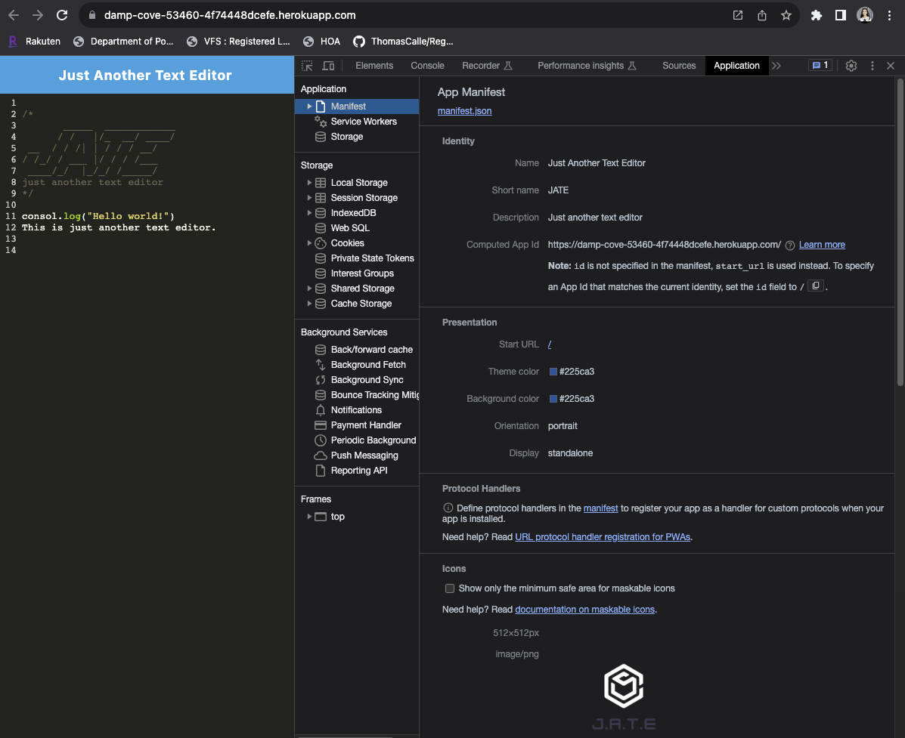
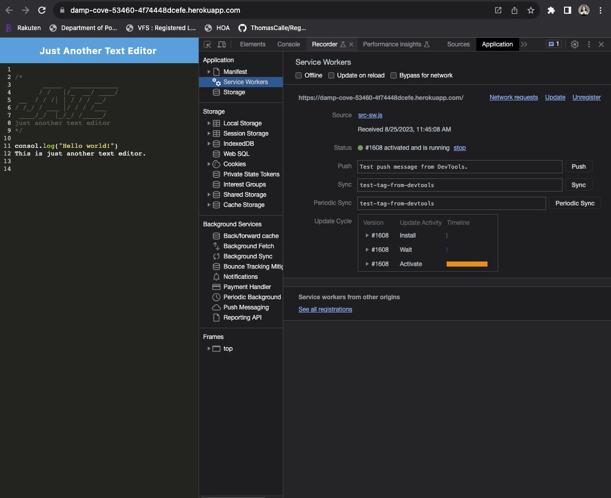
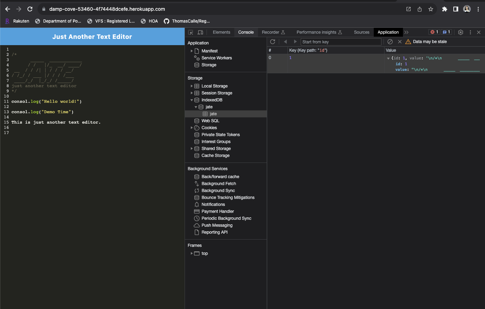

# PWA-Text-Editor

[](https://opensource.org/licenses/MIT)

## Description

The PWA-Text-Editor is a Progressive Web Application (PWA) that provides a convenient way for developers to create, store, and manage notes or code snippets. With offline functionality and seamless integration of modern web technologies, this text editor aims to enhance productivity regardless of network connectivity.

## Table of Contents:
- [Overview](#Overview)
- [The Challenge](#The-Challenge)
- [Usage Information](#Usage-Information)
- [Installation Process](#Installation-Process)
- [Built With](#Built-With)
- [License](#License)
- [Author](#Author)
- [Acknowledgments](#Acknowledgments)

# Overview

### User Story

```
AS A developer
I WANT to create notes or code snippets with or without an internet connection
SO THAT I can reliably retrieve them for later use
```

### Acceptance Criteria 

```
GIVEN a text editor web application
WHEN I open my application in my editor
THEN I should see a client server folder structure
WHEN I run `npm run start` from the root directory
THEN I find that my application should start up the backend and serve the client
WHEN I run the text editor application from my terminal
THEN I find that my JavaScript files have been bundled using webpack
WHEN I run my webpack plugins
THEN I find that I have a generated HTML file, service worker, and a manifest file
WHEN I use next-gen JavaScript in my application
THEN I find that the text editor still functions in the browser without errors
WHEN I open the text editor
THEN I find that IndexedDB has immediately created a database storage
WHEN I enter content and subsequently click off of the DOM window
THEN I find that the content in the text editor has been saved with IndexedDB
WHEN I reopen the text editor after closing it
THEN I find that the content in the text editor has been retrieved from our IndexedDB
WHEN I click on the Install button
THEN I download my web application as an icon on my desktop
WHEN I load my web application
THEN I should have a registered service worker using workbox
WHEN I register a service worker
THEN I should have my static assets pre cached upon loading along with subsequent pages and static assets
WHEN I deploy to Heroku
THEN I should have proper build scripts for a webpack application
```

## Usage Information:
The PWA-Text-Editor is designed to allow developers to create and store notes or code snippets conveniently. The application's key features include:
- Offline usability: The app works both online and offline, ensuring you can create and access your content even without an internet connection.
- IndexedDB Integration: The app utilizes IndexedDB for local data storage, ensuring your content is saved and accessible locally.
- Easy Installation: You can install the app on your device's home screen for quick access.
- Service Worker: The app is powered by a service worker that caches static assets for faster loading and offline usage.

To start using the PWA-Text-Editor, follow the installation process and launch the app.

## GitHub Repository:
[GitHub Repository](https://github.com/jaldhara21/PWA-Text-Editor)

## The Heroku deployed link:
[The Heroku deployed link](https://damp-cove-53460-4f74448dcefe.herokuapp.com/)


## The following animation demonstrates the application's functionality:

[Click Here to Watch](https://drive.google.com/file/d/1KW2gJR2r-XfwyptdNxkQ_9YoajyLNaGm/view)


## The following image shows the application's ```manifest.json``` file:



## The following image shows the application's registered service worker:



## The following image shows the application's IndexedDB storage:



## Installation Process:

1. Pull down and/or branch this repository
2. Run ```npm i``` to install all dependencies
3. Invoke application with ```npm run start```

## Built With:
The PWA-Text-Editor is built using the following technologies:

- Frontend: HTML, CSS, JavaScript
- Backend: Node.js, Express.js
- Webpack: For bundling JavaScript files and generating HTML, service worker, and manifest files
- IndexedDB: For local data storage
- Workbox: For service worker management and caching
- Heroku: For deployment

## License & Copyright ©
  
[](https://opensource.org/licenses/MIT) [Open Source Initiative Link](https://opensource.org/licenses/MIT)


## Author

Follow me on Github at [jaldhara21](https://github.com/jaldhara21)! Additional questions or concerns? feel free to contact me.

Until next, bye!

© 2023 [jaldhara21](https://github.com/jaldhara21). Confidential and Proprietary. All Rights Reserved.